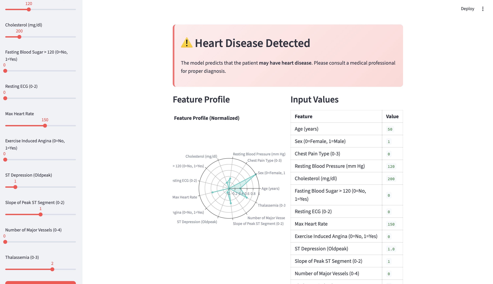

## Streamlit Introduction

Data Science models often need to be shared and presented in an interactive manner for various applications. Streamlit provides a convenient platform to build user-friendly interfaces, allowing practitioners to showcase their remarkable machine learning models to a broader audience effectively.

## Lab Objective

Before we move forward, we highly recommend completing the [FastAPI_Labs](../FastAPI_Labs/src/) if you haven't already. The FastAPI Labs will teach you how to train and host your own machine learning classification model. In this new lab, we'll build upon what you learned and add a clean, user-friendly interface to interact with your model.

## What's New

The following features were added to the original Streamlit dashboard:

### 1. Heart Disease Prediction Model

The dashboard now connects to a **Heart Disease Prediction** FastAPI backend. The model uses 13 clinical features (age, sex, chest pain type, blood pressure, cholesterol, etc.) to predict whether a patient may have heart disease.

### 2. Dual Input Method — Sliders & JSON File Upload

Users can choose between two input methods via a radio toggle in the sidebar:

- **Sliders**: Adjust all 13 heart disease features interactively. Each slider has appropriate ranges and labels.
- **JSON File Upload**: Upload a JSON file containing patient data. Useful for pre-configured or batch-style predictions.

### 3. Prediction Visualization

After a prediction is made, the dashboard displays:

- **Prediction Card**: A color-coded card showing the result — red for heart disease detected, green for no heart disease.
- **Radar Chart**: A normalized radar chart (built with Plotly) showing how the input features compare across their ranges.
- **Feature Summary Table**: A table displaying the exact input values used for prediction.

## Project Structure

```
Streamlit_Labs/
├── assets/                # Screenshot images for documentation
├── data/
│   └── test.json          # Sample JSON input file
├── src/
│   ├── __init__.py
│   └── Dashboard.py       # Main Streamlit application
├── README.md
└── requirements.txt
```

## Installing Required Packages

### Option 1: Using requirements.txt (Recommended)

1. Create a virtual environment:
```
python3 -m venv streamlitenv
```

2. Activate the virtual environment:

For Mac & Linux:
```
source ./streamlitenv/bin/activate
```
For Windows:
```
.\streamlitenv\Scripts\activate
```

3. Install packages:
```
pip install -r requirements.txt
```

### Option 2: Manual Install

```
pip install streamlit fastapi uvicorn plotly requests
```

> **Note:** `plotly` is required for the radar chart visualization.

## Running the Application

### Step 1: Start the FastAPI backend

Make sure the FastAPI server from the FastAPI Labs is running:

```
cd FastAPI_Labs/src
uvicorn main:app --reload
```

### Step 2: Start the Streamlit frontend

```
cd Streamlit_Labs/src
streamlit run Dashboard.py
```

The dashboard will open at `http://localhost:8501`.

## How to Use

1. Check the sidebar — it will show whether the backend is online.
2. Select your input method:
   - **Sliders**: Adjust the 13 feature sliders to the patient's values.
   - **JSON File Upload**: Upload a JSON file in the following format:
   ```json
   {
       "input_test": {
           "age": 55,
           "sex": 1,
           "cp": 2,
           "trestbps": 130,
           "chol": 250,
           "fbs": 0,
           "restecg": 1,
           "thalach": 150,
           "exang": 0,
           "oldpeak": 1.5,
           "slope": 1,
           "ca": 0,
           "thal": 2
       }
   }
   ```
   A sample file is available at `data/test.json`.
3. Click **Predict**.
4. View the prediction result card, radar chart, and feature summary.

## Key Streamlit Components Used

| Component | Purpose |
|---|---|
| `st.radio` | Toggle between slider and JSON input methods |
| `st.slider` | Adjust feature values interactively |
| `st.file_uploader` | Upload JSON test files |
| `st.plotly_chart` | Render the radar chart visualization |
| `st.markdown` | Display styled prediction cards (HTML) |
| `st.session_state` | Persist input data across sidebar/body scopes |
| `st.spinner` | Show loading state during prediction |
| `st.toast` | Display error notifications |


